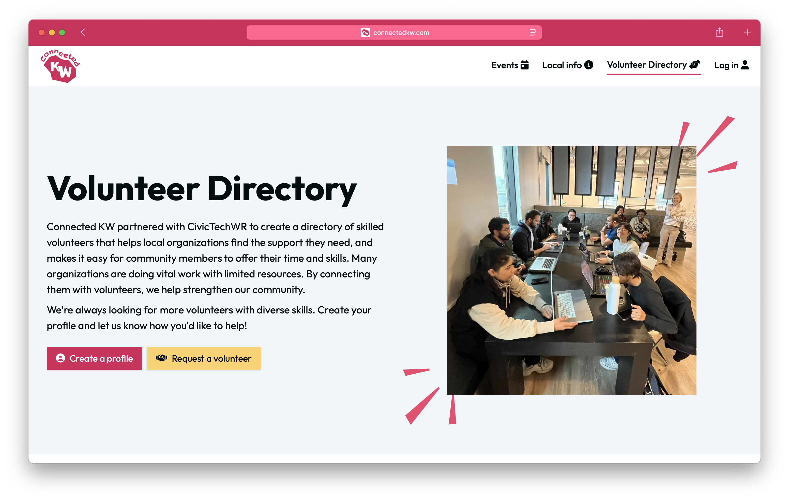

Connected KW is a volunteer-run project with the goal of creating an inclusive and comprehensive resource for families in Waterloo Region. You can get involved by [creating an account](https://cms.connectedkw.com/admin/register) and helping us to add events and info for other families!

<!-- more -->
## What was the Problem?
At the core, it’s about helping people connect with their community in meaningful ways. I think a lot of us—myself included, and others at Civic Tech—want to get involved locally, but it’s not always clear how to start. Some people look to events as a way to engage, while others are interested in volunteering. But in both cases, the path to connection can feel scattered or hard to navigate.

With the Volunteer Directory, we wanted to complement existing platforms like VolunteerWR, which do a great job posting volunteer opportunities. Our directory flips that model—it highlights the volunteers themselves. People can create profiles outlining their skills, interests, causes they care about, and what they'd like to learn. Then, nonprofits can either request a specific volunteer or talk to us about their needs, and we’ll help match them with someone whose skills align.

We also recognized that many community organizations are stretched thin. They may have needs or ideas but not the time or resources to define a formal volunteer role. Our directory supports a more collaborative approach—pairing skilled volunteers with organizations to co-create solutions or projects together. It’s less about filling a shift and more about engaging volunteers as partners who bring valuable knowledge and creativity to the table.

Shay: 
> I started ConnectedKW while I was on maternity leave with my youngest daughter. At the time, I was trying to figure out how to stay socially connected and engage with the community—but my availability was mostly weekdays during the day, which made it challenging. I wanted to get out and do things, but I kept finding myself missing events, even though I was following local Instagram accounts and checking different event calendars.
> It felt like there was no single, reliable source for finding out what was happening—especially for family-friendly events—so I decided to solve my own problem. I started building an aggregated events feed that focused on the kinds of things I wanted to attend. It was fun to create and genuinely helped me discover local events.
> After working on it solo for a while, I brought the project to Civic Tech Waterloo Region to see if others might be interested in contributing. I found a great group of volunteers who were eager to help. Together, we identified a new opportunity: creating a volunteer directory to connect people who want to support nonprofits with organizations that need help. So in addition to the events page, we’ve added a local volunteer page—and that’s what the Civic Tech team has been focused on this season.

## People Involved 
The team of volunteers behind ConnectedKW has been absolutely amazing. They come from diverse backgrounds and varying levels of technical expertise, yet everyone has found meaningful ways to contribute. Some have focused on the technical side—developing features, adding to the website, even learning JavaScript, React, or our backend platform as they went. Others have supported outreach efforts, connected with local organizations, conducted user research, helped with testing, and contributed to the website’s copy and content. 

It’s been incredible to see how each volunteer brings their unique skills and capacity to the project, making it a true collaborative effort.

- Shay Kennedy [Github account](https://github.com/s-kennedy) & [Linkedin Account](https://www.linkedin.com/in/shaydreamside/)
- Indy Ng [Github account](https://github.com/writingindy) & [Linkedin Account]()
- Thrishma Reddy [Github account](https://github.com/thrishma) & [Linkedin Account](https://www.linkedin.com/in/thrishma-reddy)
- Nipun Grover [Github account](https://github.com/NipunGrover) & [Linkedin Account]()
- Sahir Prajapati [Github account](https://github.com/noiteration) & [Linkedin Account]()
- Karandeep [Github account](https://github.com/Goldbreaker) & [Linkedin Account]()
- Syed S. Albiz [Github account](https://github.com/ssalb1z) & [Linkedin Account]()
- Resham Singh [Github account](https://github.com/dive-up) & [Linkedin Account]()
- ssalbiz [Github account](https://github.com/ssalbiz-relay) & [Linkedin Account]()

Civic Tech volunteers have brought a wave of new energy, ideas, and motivation to the project—things I never would have come up with on my own. The idea for the volunteer directory, for example, wasn’t mine originally, but it’s become such a valuable addition. That kind of creative input has really expanded the vision of what ConnectedKW could be.

More than anything, having a team around this project has kept it alive. If I were still doing it on my own, I probably would have given up by now. But seeing other people take an interest, recognize the value, and suggest new directions has made it feel worth continuing. Their involvement has turned it from a personal side project into something collaborative and sustainable.

## Technology Used
The project has evolved over two seasons at Civic Tech. In the first season, the focus was on creating the initial version of the Volunteer Directory. It was a pretty simple setup—mostly just a page layout with basic search and filter functionality—and it only featured CivicTech volunteers. The team entered all the profiles manually through the backend and used the directory as a kind of internal showcase.

In the second season, the team shifted their focus toward making the platform more self-serve and accessible to the broader community. Now, anyone can submit a volunteer profile directly through the website, not just Civic Tech members. The team also introduced a request form for organizations, so they can reach out to find volunteers through the site instead of emailing them directly. The idea was to make the whole process more open, easier to use, and scalable beyond our internal network.

You can see the repo for the full project at: https://github.com/CivicTechWR/connectedkw

## Impact on Civic Community
One thing that always surprises me—in the best way—is the level of enthusiasm some volunteers bring right from day one. It’s incredible to see people show up to their first Civic Tech meeting and immediately dive into the code, eager to contribute. This past season, we had a few volunteers who jumped straight into our existing codebase, spotted a bug or an opportunity for improvement, and just got to work on it. Watching someone take ownership of a project they’ve just joined is always such a treat.

It’s also fascinating to see the different ideas and directions people bring to the table. For example, one volunteer took on the task of building a tagging system. I was expecting a simple list of tags—but they came back with a full taxonomy, complete with categories and subcategories. They really ran with it and took it far beyond what we had imagined, just based on their own passion and interest.

Shay: 
>I really hope that ConnectedKW helps people in our region feel a greater sense of belonging and connection to the community. I want people to feel like they have options for getting involved—that they can participate in local life in a way that feels meaningful to them.
>Our region is growing quickly, and with that growth comes a lot of new residents who are trying to find their place. My hope is that ConnectedKW can serve as a bridge—whether through discovering events, learning more about what’s happening locally, or getting involved through volunteering. It’s about making it easier for people to feel like they’re part of something.

## What's Next (Opportunity for Sponsors)
The next step for ConnectedKW is to focus on marketing and outreach—getting the word out to more people in the community about what the platform offers. We’ve spent a lot of time building features and improving the site, but we haven’t yet done a great job of making sure the broader community knows it exists. So moving forward, spreading awareness and encouraging more people and organizations to use the platform will be our main priority.

Shay: 
>I’m especially proud of the level of self-direction and collaboration within our group. While I may have started the project, I’ve realized I’m not essential as a project lead or manager—and that’s a good thing. The volunteers have truly taken ownership of the project. They’ve been able to take the broader vision and break it down into roles and tasks that each person can run with independently.
>What’s been most impressive is how committed people are—not just to showing up, but to following through, even when it means learning new skills or tackling unfamiliar technologies. It’s been amazing to watch our team come together around a shared goal without needing a lot of structure or oversight. That kind of organic coordination is something I’m really proud of.

